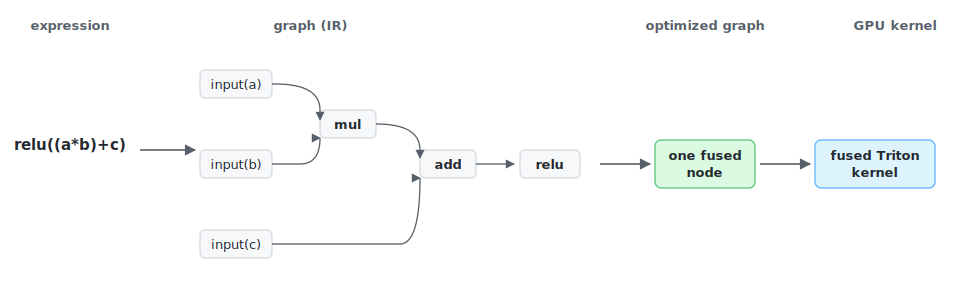
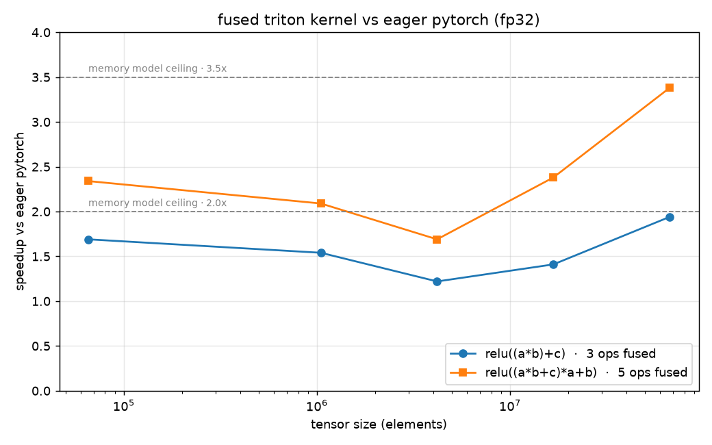

# GraphFuse

A small optimizing compiler that takes tensor expressions like `relu((a * b) + c)` and generates a single fused Triton GPU kernel instead of running each operation separately. Built from scratch: IR, optimization passes, fusion, and codegen.

## Why build this when `torch.compile` exists

This is a from-scratch implementation of the same pipeline, which I built to understand how fusion compilers actually work.

The benchmarks below compare against **eager** PyTorch, to analyze what kernel fusion actually buys us at compile time.

## Main idea

Running operations one at a time is wasteful. For example, computing `a * b`, then adding `c`, then applying `relu` means three separate kernels, each writing its intermediate result out to memory and reading it back. These operations do almost no arithmetic per byte, so those round trips dominate the runtime — the GPU spends its time waiting on memory, not computing.

GraphFuse looks at the whole expression first and generates one kernel that does all three steps in a single pass, keeping intermediates in registers.

## How much this should help

Before measuring anything, we can predict the win by counting bytes moved. Each operation in an unfused chain reads its inputs and writes its output; a fused kernel reads the original inputs once and writes the final result once.

So for `relu((a*b+c)*a + b)` on tensors of `n` elements:

```
unfused:  mul(a,b)  2 reads + 1 write = 3
          add(t,c)  2 reads + 1 write = 3
          mul(t,a)  2 reads + 1 write = 3
          add(t,b)  2 reads + 1 write = 3
          relu(t)   1 read  + 1 write = 2
                                       ── 14n
fused:    read a, b, c once, write once  4n

                        predicted: 14/4 = 3.5x less traffic
```

Since the chain is memory-bound, essentially all of the runtime is memory traffic, so that ratio is close to the achievable speedup — there's no substantial slack left in the workload. My benchmark below tests whether the implementation reaches it.

## How it works



The graph is a plain Python data structure, so all rewriting happens on the CPU before any GPU code exists. That separation is the whole point: reasoning about the program is cheap until you commit to kernels.

Passes, in order:

- **Dead code elimination** — drop operations nothing depends on.
- **Constant folding** — evaluate operations over known constants at compile time.
- **Common subexpression elimination** — compute repeated subexpressions once.
- **Fusion** — collapse chains of elementwise operations into a single node.

Codegen then turns each fused node into a Triton kernel.

For the deeper design reasoning see [DESIGN.md](DESIGN.md).

## Correctness

An optimization is only valid if it doesn't change the answer, so correctness is checked by **differential testing**: a reference interpreter executes the graph op-by-op with PyTorch, and every optimized graph is checked against the unoptimized one through it. Generated Triton kernels are checked against PyTorch directly.

This is all wired into a test suite, so `uv run pytest` runs it. The pass and codegen tests run anywhere; the kernel-vs-PyTorch tests need a GPU and skip themselves otherwise.

## Results

Measured on an RTX Pro 6000 Blackwell (96GB), fp32, against eager PyTorch.

Timing uses Triton's `do_bench`: 25 ms of warmup, then the average over ~100 ms of timed runs, measured with CUDA events and an L2 cache flush between runs (so a warm cache doesn't hide the memory traffic we're trying to measure).



| expression | ops fused | predicted traffic saving | measured speedup | at size |
|---|---|---|---|---|
| `relu((a*b)+c)` | 3 → 1 kernel | 2.0× | **1.9×** | 67M (2²⁶) |
| `relu((a*b+c)*a + b)` | 5 → 1 kernel | 3.5× | **3.4×** | 67M (2²⁶) |

Measured speedup tracks the memory model closely (dashed lines in the chart), which is the result worth caring about: the fused kernels are reaching the bandwidth ceiling rather than leaving performance on the table. The longer the fused chain, the larger the win, because the fused version reads its inputs once and writes once regardless of how many operations sit in between.

At small sizes the speedup falls off as kernel launch overhead starts to dominate.

## Try it

Uses [uv](https://docs.astral.sh/uv/) for dependencies.

```bash
uv sync
```

**Run the tests** (no GPU needed — the GPU-only tests skip themselves):

```bash
uv run pytest
```

**See the pipeline run** (no GPU needed — builds a graph, runs it, shows each pass rewriting it):

```bash
uv run python -m graphfuse.demo
```

**Check a generated kernel is correct** (CUDA GPU — fuses `relu((a*b)+c)`, generates a Triton
kernel, runs it, confirms it matches PyTorch):

```bash
uv run python -m graphfuse.gpu_check
```

**Reproduce the benchmark** (CUDA GPU):

```bash
uv run python -m graphfuse.bench
```

## Layout

```
graphfuse/
  graph.py         the IR: Node, Graph, and topological sort
  interpreter.py   runs a graph op-by-op with PyTorch (the correctness reference)
  passes.py        dead code elimination, constant folding, CSE
  fuse.py          groups elementwise chains and rewrites them into fused nodes
  codegen.py       turns a fused node into a Triton kernel
  demo.py          end-to-end walkthrough (no GPU needed)
  gpu_check.py     validates a generated kernel against PyTorch (GPU)
  bench.py         speedup + memory-traffic benchmark (GPU)
```

## Scope

The pipeline is complete end-to-end for elementwise operations: build a graph, optimize, generate a Triton kernel, verify against PyTorch, run faster. Fusable ops are `add`, `mul`, and `relu`; `matmul` and `sum` execute in the interpreter but are not fused.

Reduction fusion is the natural next step and the substantially harder problem — elementwise chains fuse trivially because every element is independent, while reductions force decisions about tiling and cross-thread communication. Also planned: a single `compile()` entry point that routes fusable subgraphs to Triton and falls back to PyTorch for the rest.